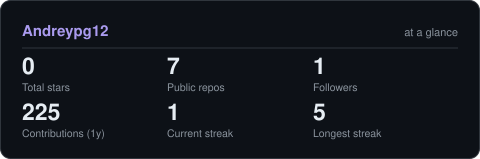

<!-- BANNER - terminal profile.sh --live (additive). Generated by scripts/banner/generate.py.
     ~0.7–0.8 MB each. Cache-bust with ?v=N after regenerating. -->
<picture>
  <source media="(prefers-color-scheme: dark)"  srcset="assets/banner-dark.v10.svg">
  <source media="(prefers-color-scheme: light)" srcset="assets/banner-light.v10.svg">
  
</picture>

 

<!-- NAME / TAGLINE - animated typing -->

 

<!-- SOCIALS — LinkedIn stays brand blue (glyph vanishes on custom fills). Others themed. -->
&nbsp;&nbsp;

 

---

## This is me :)

Hi, I'm **Andrey Pérez**, software engineering student, broadcasting from Costa Rica 🇨🇷.
I'm passionate about backend development, databases, web development and AI,
and I love building things that make real work faster and easier for people.

- 🚁 **Creator of [AgroDrone](https://github.com/Andreypg12/AgroDrone)**: an app that automates fumigation flight reports for DJI agrodrones — maps, flight routes, role separation and a clean dashboard.
- ⚙️ Comfortable across the stack: **Java · C# · Python · TypeScript** and, above all, **SQL databases** (SQL Server, MySQL, PostgreSQL).
- 📚 Learning **software engineering** one shipped project at a time.
- 🤖 Deeply interested in **AI** and how it can improve everyday tools and business workflows.
- 💼 Big fan of **Microsoft 365** for automating day-to-day work.
- 💬 Ask me about **backend, databases or web development** and I won't stop talking.
 

## my perfect stack`

---

## signals 

<table>
<tr>
<td width="50%" align="center" valign="middle">

<!-- Self-rated radar - edit assets/skills.json, the workflow redraws it -->
<picture>
  <source media="(prefers-color-scheme: dark)"  srcset="assets/radar-dark.svg">
  <source media="(prefers-color-scheme: light)" srcset="assets/radar-light.svg">
  
</picture>

</td>
<td width="50%" align="center" valign="middle">

<!-- Hand-authored contract & language stack radar - edit assets/langmix.json -->
<picture>
  <source media="(prefers-color-scheme: dark)"  srcset="assets/radar-langs-dark.svg">
  <source media="(prefers-color-scheme: light)" srcset="assets/radar-langs-light.svg">
  
</picture>

</td>
</tr>
</table>

---

## Numbers matter? ohhh yes. 

<!-- Generated by scripts/cards.py into this repo. Deliberately NOT
     github-readme-stats / streak-stats / github-profile-trophy: those are
     shared public instances that go down and take the whole section with them. -->
<picture>
  <source media="(prefers-color-scheme: dark)"  srcset="assets/card-stats-dark.svg">
  <source media="(prefers-color-scheme: light)" srcset="assets/card-stats-light.svg">
  
</picture>

 

---

` Build with love · @Andreypg12 `

